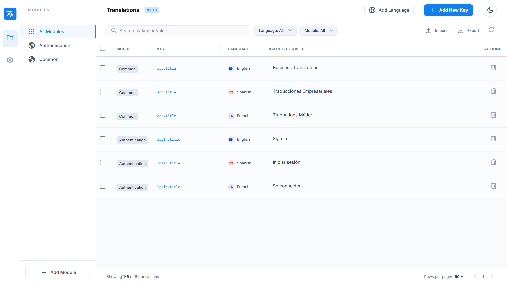

# Business.Translations

An ASP.NET package that provides a built-in UI dashboard and REST API for managing translations (i18n) in your application.



## Quick Start

```bash
dotnet add package BusinessTranslations
```

```csharp
var app = builder.Build();

app.UseBusinessTranslations(config =>
{
    config.UseSqlServer("your-connection-string");
    // config.BasePath = "bt"; // optional, defaults to "bt"
});

app.Run();
```

### Authorization

Protect all BT endpoints (dashboard + API) by providing your own `IEndpointFilter`:

```csharp
// 1. Create your filter
public class MyAuthFilter : IEndpointFilter
{
    public async ValueTask<object?> InvokeAsync(
        EndpointFilterInvocationContext context,
        EndpointFilterDelegate next)
    {
        var user = context.HttpContext.User;

        if (user.Identity?.IsAuthenticated != true || !user.IsInRole("Admin"))
        {
            return Results.Json(
                new { success = false, message = "Unauthorized." },
                statusCode: StatusCodes.Status401Unauthorized);
        }

        return await next(context);
    }
}

// 2. Register it
app.UseBusinessTranslations(config =>
{
    config.UseSqlServer("your-connection-string")
          .UseAuthorizationFilter(new MyAuthFilter());
});
```

Then navigate to `/bt/dashboard` in your browser to manage translations.

### Initialize the Database

Send a POST to `/bt/createTables` to create the required tables (`BTLanguages`, `BTModules`, `BTTranslations`). This is idempotent — safe to call multiple times. The dashboard also triggers it automatically on first load.

## Features

- **Dashboard UI** — React-based SPA served at `/{basePath}/dashboard`, shipped embedded in the package (no extra files to deploy)
- **Full CRUD** for translations, modules, and languages via REST API
- **CSV export/import** from the dashboard, backed by a bulk upsert endpoint
- **Automatic schema bootstrap** — required tables are created on first dashboard load (or via `POST /bt/createTables`)
- **Configurable base path** — all endpoints scoped under `/{basePath}/`
- **Optional authorization** — protect the dashboard and API with your own `IEndpointFilter`

## API Endpoints

All endpoints are prefixed with `/{basePath}` (default: `/bt`).

| Method | Path                    | Description                                                                    |
| ------ | ----------------------- | ------------------------------------------------------------------------------ |
| GET    | `/bt/dashboard`         | UI dashboard                                                                   |
| POST   | `/bt/createTables`      | Create database tables                                                         |
| GET    | `/bt/translations`      | List translations (supports `?moduleId=&languageId=&keywords=&limit=&offset=`) |
| POST   | `/bt/translations/bulk` | Bulk upsert translations (max 10000 rows) — used by CSV import |
| POST   | `/bt/translations`      | Create a translation                                                          |
| PUT    | `/bt/translations/{id}` | Update a translation                                                          |
| DELETE | `/bt/translations/{id}` | Delete a translation                                                          |
| DELETE | `/bt/translations`      | Delete multiple translations (`{ ids: number[] }`)                             |
| GET    | `/bt/modules`           | List modules                                                                   |
| POST   | `/bt/modules`           | Create a module                                                                |
| PUT    | `/bt/modules/{id}`      | Update a module                                                                |
| DELETE | `/bt/modules/{id}`      | Delete a module                                                                |
| GET    | `/bt/languages`         | List languages                                                                 |
| POST   | `/bt/languages`         | Create a language                                                              |
| PUT    | `/bt/languages/{id}`    | Update a language                                                              |
| DELETE | `/bt/languages/{id}`    | Delete a language                                                              |

## Development

See [DEVELOPMENT.md](DEVELOPMENT.md) for how to work on this project — local setup, testing, and the local package workflow.

## License

MIT — see [LICENSE](LICENSE).
